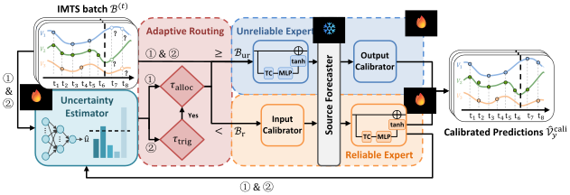

<div align="center">
    <h1 align="center">Online Irregular Multivariate Time Series Forecasting via Uncertainty-Driven Dual-Expert Calibration</h1>

  <p>
    <a href="https://www.pytorch.org"></a>
    <a href="https://arxiv.org/abs/2605.28603"></a>
    <a href="https://mit-license.org/"></a>
  </p>
</div>


This code is the official PyTorch implementation of our paper accepted by KDD 2026: Online Irregular Multivariate Time Series Forecasting via Uncertainty-Driven Dual-Expert Calibration.


# 🧾 Introduction

Irregular multivariate time series (IMTS) forecasting is critical in many real-world applications, where time series are irregularly sampled and exhibit dynamically evolving missingness patterns. Although existing methods perform well in offline settings, they often suffer from significant performance degradation when deployed online due to dynamic shifts in data distribution. Maintaining forecasting capability in such dynamic scenarios typically necessitates online adaptation techniques. Since irregular sampling fundamentally undermines temporal continuity and periodicity, we cannot leverage these widely studied characteristics from regular MTS for online learning. To this end, we study the problem of online IMTS forecasting and propose Under-Cali, an uncertainty-driven dual-expert calibration framework consisting of three core components: an uncertainty estimator, a dual-expert calibration module, and an adaptive routing module. We design an uncertainty estimator that serves as the core control signal to jointly manage inference and adaptation processes. In our framework, the uncertainty estimator first assesses uncertainty for each incoming batch. The adaptive routing module then directs samples with high uncertainty to the unreliable expert for calibration, while low uncertainty samples remain with the reliable expert. Subsequently, the system updates the reliable expert and the uncertainty estimator using well-calibrated reliable samples, and updates the unreliable expert with challenging samples, enabling stable and efficient online learning. Under-Cali keeps the source forecasting model frozen and performs adaptation only through a lightweight, model-agnostic calibration module, enabling efficient adaptation. Extensive experiments on IMTS benchmarks demonstrate consistent improvements with low computational cost.

<p align="center">
  
</p>


# 🛠️ Quickstart

> This project is fully tested under Python 3.10.18. It is recommended that you set the Python version to 3.10.18.

## 1. Requirements

Given a python environment (**note**: this project is fully tested under python 3.10.18 and PyTorch 2.0.1+cu117), install the dependencies with the following command:

```shell
pip install -r requirements.txt
```

## 2. Data Preparation

Our model is evaluated on four widely used irregular time series datasets: **PhysioNet**, **MIMIC**, **HumanActivity**, and **USHCN**. The data preparation process differs slightly depending on the dataset's access restrictions.

### 2.1 Public Datasets (Auto-Download)
For **HumanActivity**, **PhysioNet ('12)**, and **USHCN**, you generally do not need to prepare the data manually. Our code allows for automatic downloading and preprocessing upon the first run.

- **HumanActivity**: The script will automatically download and process the data. The processed files will be stored in:
  ```
  ./storage/datasets/HumanActivity
  ```
- **PhysioNet & USHCN**: These datasets are managed via the `tsdm` library. They will be automatically downloaded and cached in your home directory:
  ```
  ~/.tsdm/datasets/  # Processed data
  ~/.tsdm/rawdata/   # Raw data
  ```

### 2.2 MIMIC Dataset
Due to privacy regulations, the **MIMIC** dataset requires credentialed access. Please follow the steps below to prepare it manually:

1.  **Request Access**: Obtain the raw data from [MIMIC](https://physionet.org/content/mimiciii/1.4/). You do not need to extract the `.csv.gz` files.
2.  **Preprocessing**: We adopt the standard preprocessing pipeline from **gru_ode_bayes**.
    - Clone the [gru_ode_bayes](https://github.com/edebrouwer/gru_ode_bayes/tree/master/data_preproc/MIMIC) repository.
    - Follow their instructions to generate the `complete_tensor.csv` file.
3.  **File Placement**: Move the generated `complete_tensor.csv` to the specific path expected by our dataloader (create folders if they don't exist):

```bash
mkdir -p ~/.tsdm/rawdata/MIMIC_III_DeBrouwer2019/
mv /path/to/your/complete_tensor.csv ~/.tsdm/rawdata/MIMIC_III_DeBrouwer2019/
```

Once the file is in place, our code will handle the final formatting (generating `.parquet` files) automatically during the first training session.

## 3. Train and Test 

- We provide all the experiment scripts for UnderCali and the baselines we used under the folder `./scripts`. For example you can reproduce the experiment results on the USHCN dataset as the following script:

```shell
bash scripts/model_name/USHCN.sh
```
- Testing will be automatically conducted once the training finished. If you wish to run test only, change command line argument `--is_training` in training script from 1 to 0 and run the script.


# 📝 Citation
If you find our work useful in your research, please consider citing our paper:

```bibtex
@article{wen2026online,
  title={Online Irregular Multivariate Time Series Forecasting via Uncertainty-Driven Dual-Expert Calibration},
  author={Wen, Haonan and Chen, Hanyang and Feng, Songhe},
  journal={arXiv preprint arXiv:2605.28603},
  year={2026}
}
```

# 🙏 Acknowledgement

This code is built upon the [PyOmniTS](https://github.com/Ladbaby/PyOmniTS) library. We thank the contributors of PyOmniTS for providing a solid foundation for our implementation. We also acknowledge the original authors of the datasets and baselines used in our experiments for making their work publicly available.
